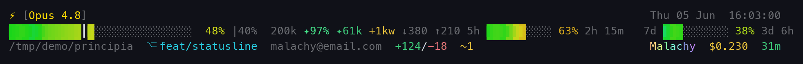

<p align="center">
  
</p>

<h1 align="center">claude-statusline</h1>

<p align="center">
  A three-line animated statusline for <a href="https://claude.ai/code">Claude Code</a> —
  truecolor gradient bars, git context, usage limits, and a pile of opt-in whimsy.<br/>
  Pure Node.js, cross-platform (Windows / macOS / Linux), no dependencies beyond <code>node</code>.
</p>

# **About**
---

A drop-in `statusLine` command that renders three lines on every repaint:

- **Line 1** — permission glyph · model · effort · thinking mode | clock (with seconds)
- **Line 2** — animated context bar · % · cache stats | 5h & 7d usage-limit bars
- **Line 3** — path › last file · git branch · email · deltas | account name · cost · session age

The context bar is drawn with **half-blocks (`▌`)** sampled twice per character for a smooth
truecolor gradient, and a moving hue crest animates it. Everything beyond the core is an opt-in
`SL_*` toggle, so the default stays clean and you bolt on exactly what you want.

<p align="center">
  <br/>
  <em>Everything switched on: pet, crest, moon, day/night clock, cost flair, burn rate, git extras, rainbow stats.</em>
</p>

# **Features**
---

### Themes — `SL_THEME`

The chosen theme recolors the **whole** statusline — bars, usage limits, git, cost, name, everything.

<p align="center"></p>

| Value | Look |
|-------|------|
| `heat` | Green→red heat gradient (default) |
| `synthwave` | Magenta→cyan neon |
| `matrix` | All-green, dark→bright ramp |
| `mono` | Greyscale brightness ramp |
| `pastel` | Soft, desaturated |
| `dracula` | Green · cyan · purple · pink |
| `nord` | Cool arctic blues |
| `gruvbox` | Warm retro earth tones |
| `tokyonight` | Blue · cyan · purple · pink |
| `rosepine` | Muted pine · foam · iris · rose |

More palettes (all recolor the whole statusline):

| Group | Values |
|-------|--------|
| Catppuccin | `catppuccin-latte` · `catppuccin-frappe` · `catppuccin-macchiato` · `catppuccin-mocha` |
| Editor | `solarized-dark` · `solarized-light` · `kanagawa` · `everforest` · `onedark` · `ayu-dark` · `ayu-mirage` · `ayu-light` · `github-dark` · `github-light` · `monokai` · `monokai-pro` |
| Retro / loud | `cyberpunk` · `phosphor` · `phosphor-green` · `phosphor-white` |
| Muted | `verdigris` · `sumi-e` · `stealth` · `zen` · `void` · `gothic` · `oceanic` |
| Identity | `pride` · `trans` · `bi` · `ace` · `nonbinary` |
| Reactive | `silver-halide` (crisp silver → deep-red **danger wash** when context/limits go critical) |

**Reactive theming** — `SL_AUTO_THEME=daynight` switches between `SL_DAY_THEME` and `SL_NIGHT_THEME`
by the hour; `=seasonal` tracks the month; `=branch` maps the git branch to a theme
(`main`→nord, `feat/*`→everforest, `fix/*`→gruvbox, `hotfix/*`→heat, `experiment/*`→tokyonight;
override any with `SL_BRANCH_MAIN`/`_FEAT`/`_FIX`/`_HOTFIX`/`_EXP`). `SL_DANGER=on` (implied by
`silver-halide`) washes the whole line a throbbing safelight red once context ≥ 90% or a usage limit
is critical.

<p align="center"><br/>
  <em><code>silver-halide</code> — crisp until context goes critical, then the darkroom safelight wash.</em></p>

### Colormap themes

Perceptually-uniform [matplotlib](https://matplotlib.org/stable/users/explain/colors/colormaps.html) colormaps, sampled as multi-stop gradients.

<p align="center"></p>

| Value | Look |
|-------|------|
| `viridis` | Purple → teal → green → yellow |
| `inferno` | Black → purple → red → orange → yellow |
| `magma` | Black → purple → pink → cream |
| `plasma` | Blue → magenta → orange → yellow |
| `cividis` | Deep blue → muted gold |
| `twilight` / `twilight_shifted` | **Cyclic** — ends match, so a looping crest wraps seamlessly |
| `cubehelix` | Monotonic brightness (legible even in greyscale) |
| `batlow` | Perceptually-uniform, CVD-safe (Crameri) |
| `turbo` | Vivid jet-replacement (Google) |
| `coolwarm` / `rdbu` | Diverging blue↔red |
| `ice` / `deep` | Oceanographic (cmocean) |

### Custom themes — `SL_THEME=custom`

Bring your own palette without touching the code. Resolved at runtime, in order:

1. **A JSON file** at `~/.claude/statusline-theme.json` (or any path in `SL_THEME_FILE`):
   ```json
   { "cmap": [[13,8,135],[240,249,33]], "mix": 20,
     "palette": { "RED":[255,0,0], "GREEN":[0,255,0], "AMBER":[255,200,0],
                  "BLUE":[0,0,255], "CYAN":[0,255,255], "WHITE":[240,240,240], "GOLD":[255,215,0] } }
   ```
   Provide a `cmap` (multi-stop bar gradient) **or** a hue ramp (`hueHi`/`hueLo`/`sat`/`valLo`/`valHi`),
   plus an optional `palette`. Anything malformed falls back to `heat` — it never errors.
2. **base16** via `SL_BASE16` — 16 comma/space-separated hex values (`#rrggbb`). Every base16/base24
   scheme just works: `SL_BASE16="#282828,#cc241d,…,#ebdbb2"`.

> Adding a *built-in* theme is now a one-file data change in [`src/themes.data.ts`](src/themes.data.ts) — pure RGB, no TypeScript.

### Bar styles — `SL_BAR_STYLE`

<p align="center"></p>

| Value | Look |
|-------|------|
| `blocks` | Smooth half-block gradient (default) |
| `pacman` | `==========C····` — a muncher eating dots |
| `snake` | `~~~~@~` — a crawling snake |
| `matrix` | Green blocks with faint code-rain in the empty track |
| `braille` | `⣿` stipple |
| `battery` | Solid `█` cells |
| `thermo` | `▰▱` filled/empty squares |
| `shade` | Dithered `░▒▓█` density ramp |
| `lines` / `minimal` | Thin `━`/`─` rule |
| `rule` | Tick-marked measuring gauge `┼────┼` |
| `equalizer` / `waveform` | Animated VU-meter sub-blocks |
| `dna` | `xXxX` phase-shifting helix |
| `train` | ASCII `====O----` loco |

**`SL_BAR_SCALE`** composes with any style: `linear` (default) or `log`/`compact` — a nonlinear fill
that compresses the safe zone and **expands the danger zone**, so 90→100% occupies more cells than
10→20% (the marker and usage bars use the same mapping).

<p align="center"></p>

### Animation styles — `SL_SHIMMER`

All styles rotate **hue** at a moving crest; they differ only in how the crest travels.
(Claude Code repaints at most once/second, so the gradient is smooth but motion steps per second.)

<p align="center"></p>

| Value | Effect |
|-------|--------|
| `sweep` | A soft hue crest glides across the fill (default) |
| `wave` | A wide hue ripple rolls along |
| `comet` | Hue crest with a fading trail |
| `breathe` | The whole fill shifts hue up and back in unison |
| `scan` | A narrow crest bounces back and forth |
| `drift` / `aurora` | Wide, slow hue undulation |
| `plasma` | Overlapping crests — less periodic than `wave` |
| `lumin` | Brightness breathes (hue held) |
| `heartbeat` | A subtle double-pulse |
| `twinkle` | Deterministic sparkle on scattered cells |
| `storm` | A bright flash sweeps through, with occasional lightning |
| `glitch` | Brief broken hue jumps |
| `flash` / `ripple` | Event-driven — pulse / ring at the fill edge the tick the context % changes |
| `morse` | Blinks "CLAUDE" in morse along the fill |
| `off` | Static |

The "effects" tier (`drift` · `plasma` · `lumin` · `heartbeat` · `twinkle` · `storm` · `glitch` · `morse`):

<p align="center"></p>

**`SL_EASING`** (`ease` / `bounce` / `elastic`) reshapes where the crest sits each tick — composes with
`sweep`/`wave`/`comet`. Subtle at the ≤1fps repaint, by design.

### …and `disco`

<p align="center">
  <br/>
  <em><code>SL_SHIMMER=disco</code> — per-cell rainbow + vivid fast-flowing name. A joke mode. Use responsibly.</em>
</p>

# **Install**
---

1. Copy `statusline.js` somewhere, e.g. `~/.claude/statusline.js`
2. Add to your `~/.claude/settings.json` (Windows: `%USERPROFILE%\.claude\settings.json`):

```json
{
  "statusLine": {
    "type": "command",
    "command": "node ~/.claude/statusline.js",
    "refreshInterval": 1
  }
}
```

`refreshInterval` is in **seconds** (minimum `1`); the clock and animation update once per second.

> Claude Code cancels an in-flight statusline run when the next refresh fires, so a render that
> takes longer than `refreshInterval` never paints — the clock appears frozen. The statusline avoids
> this **by construction**: the hot path does no unbounded work. `git` runs entirely in a detached
> background process (each repaint paints from a cached snapshot and the child refreshes it), and the
> transcript is read as a bounded tail rather than in full. A render stays fast — and `refreshInterval: 1`
> keeps ticking — no matter how large the repo or how long the session. Worst case you see git data
> that's a refresh-cycle (~2.5s) stale; you never see a frozen clock.

**Requirements:** `node` (ships with Claude Code), optionally `git` (segments are skipped if
absent), and a terminal with **truecolor** support (iTerm2, Terminal.app, Windows Terminal, …).

<details>
  <summary>Windows notes</summary>
  <ul style="margin-left: 20px;">
    <li>Claude Code runs the statusline through <b>Git Bash</b> if <a href="https://git-scm.com/downloads/win">Git for Windows</a> is installed, otherwise <b>PowerShell</b> — the script works under both.</li>
    <li>Use <b>forward slashes</b> in the path (Git Bash eats backslashes):<br/><code>"command": "node C:/Users/you/.claude/statusline.js"</code></li>
    <li>If <code>node</code> isn't on PATH, use its full path:<br/><code>"command": "C:/Program Files/nodejs/node.exe C:/Users/you/.claude/statusline.js"</code></li>
  </ul>
</details>

# **Configuration**
---

Set everything in the `env` block of `settings.json`, e.g.:

```json
"env": {
  "SL_THEME": "synthwave",
  "SL_PET": "on",
  "SL_GIT_EXTRA": "on"
}
```

### Presets — `SL_PRESET`

A preset bundles a theme + shimmer + bar + extras in one switch. **Any individual `SL_*` var you
also set overrides the preset** (precedence: explicit var → preset → default), so a preset is just
a starting point.

| Value | Vibe |
|-------|------|
| `minimal` | Greyscale, no motion, plain bar |
| `pretty` | Synthwave + wave + crest + moon + rainbow stats |
| `focus` | Calm nord + breathe + burn rate + git extras |
| `chaos` | Everything loud — disco, pet, plasma, cost flair |
| `demo` | The kitchen-sink showcase |

```jsonc
"env": { "SL_PRESET": "pretty", "SL_THEME": "nord" }  // pretty, but force the nord palette
```

<p align="center"></p>

### Opt-in extras

All default **off**; enable with `on` / `1` / `true`. Everything is text-safe (width-1 glyphs,
no emoji), so right-alignment stays exact on every terminal.

| Variable | Effect |
|----------|--------|
| `SL_PET` | ASCII pet whose mood tracks context %: `[^_^]`→`[._.]`→`[o_o]`→`[>_<]`; `[$_$]` when cost ≥ $0.50 |
| `SL_PET_STYLE` | Pet face set: `default` · `cat` · `frog` · `robot` · `ghost` · `slime` · `dog` |
| `SL_PET_REACTS_TO` | What drives the mood: `context` (default) · `cost` · `git` · `time` · `random` |
| `SL_BELL` | Ring the terminal bell once each time context crosses into a higher band (de-duped) |
| `SL_CREST` | Per-model accent: `★` Opus · `◆` Sonnet · `▲` Haiku |
| `SL_MOON` | Moon-phase glyph (`●◐○◑`) before the clock |
| `SL_DAYNIGHT` | Clock color shifts with the real hour (dawn → midday → dusk → night) |
| `SL_COST_FLAIR` | Spend-tier prefix on cost: `·` `$` `$$` `!$` |
| `SL_BURN` | Append `$/hr` burn rate after cost (once session ≥ 60s); adds a `1.4x`-vs-your-median deviation once you have history |
| `SL_GIT_EXTRA` | Ahead/behind `↑2↓1`, last-commit age `·3m`, untracked `?N`, stash `s:N`, branch-mood tag `[wip]/[fix]/[feat]/[test]`, commits-today `✓N`, detached-HEAD `⎇ :sha`, in-progress `merge!`/`rebase!`/`cherry!` |
| `SL_GIT_RISK` | A rough composite risk tag `risk:low/med/high` from dirty/stash/ahead-behind/mid-op (deliberately arbitrary) |
| `SL_RAINBOW_STATS` | Rainbow the cost and session-age segments, like the account name |
| `SL_TREND` | Context-% sparkline `▁▂▃▄`, ETA to autocompact `~11m`, and a compaction counter `↺2` |
| `SL_WEATHER` | One-word context-pressure reading: `clear → breezy → dense → stormy → compacting` |
| `SL_LIMITS` | Flag the 5h/7d usage bars: amber past `SL_LIMIT_WARN`, bold-red `LOW` past `SL_LIMIT_CRIT` |
| `SL_SYSINFO` | Show the 1-minute load average `↯0.82` (no-op where unsupported) |
| `SL_PRIVACY` | Hide email / account / cost / path — for screenshots and streams |
| `SL_ACCESSIBLE` | High-contrast, motion off (pairs with `NO_COLOR` / `SL_COLOR_MODE=mono`) |
| `SL_RESPONSIVE` | Auto-pick the layout from the terminal width (avoids wrapping when narrow) |
| `SL_TMUX_PASSTHROUGH` | Wrap output in the tmux DCS so truecolor survives tmux (needs `allow-passthrough on`) |

`SL_TREND` records context-% history and projects an ETA to autocompact; the sparkline grows and the
weather word shifts as the session fills up:

<p align="center"></p>

`SL_PET` has seven face sets (`SL_PET_STYLE`), each with five moods:

<p align="center"></p>

### Tuning

| Variable | Default | Effect |
|----------|---------|--------|
| `SL_THEME` | `heat` | Palette (see Features) |
| `SL_BAR_STYLE` | `blocks` | Bar render style |
| `SL_SHIMMER` | `sweep` | Animation style (`…|disco|off`) |
| `SL_WAVE_HUE` | `32` | Hue rotation at crest peak (degrees) |
| `SL_SPEED` | `3` | Crest travel speed (cells/sec) |
| `SL_RAINBOW_MIX` | `50` | Rainbow pastel level (0 = vivid, 100 = white) |
| `SL_MARGIN` | `6` | Right-edge margin in columns (raise if content clips) |
| `SL_PRESET` | — | Bundle of settings (see Presets); individual vars override it |
| `SL_COLOR_MODE` | `auto` | Colour depth: `truecolor` / `256` / `16` / `mono` / `auto` |
| `SL_LIMIT_WARN` | `80` | Usage % at which `SL_LIMITS` colours a bar amber |
| `SL_LIMIT_CRIT` | `95` | Usage % at which `SL_LIMITS` shows bold-red `LOW` |
| `SL_LAYOUT` | `3line` | Vertical footprint: `3line` / `2line` / `1line` / `tiny` |
| `SL_SEPARATOR` | — | Divider glyph between major segments (e.g. `\|`, `⋮`); default is spacing |
| `SL_HIDE` | — | Comma list of segments to drop: `clock,moon,usage,name,dir,file,git,email,cost,age,tokens,weather,trend,pet,crest,model,effort,thinking,sysinfo` |
| `SL_PATH` | `auto` | Path display: `auto` (home→`~`, compress deep paths to `root/…/leaf`) or `full` |
| `SL_PRIVACY_HIDE` | — | Granular privacy list: `email,path,account,cost` |
| `SL_PROJECT_ALIASES` | — | JSON map of real dirs to safe labels, e.g. `{"/Users/me/work/acme":"client-x"}` |
| `CLAUDE_AUTOCOMPACT_PCT_OVERRIDE` | — | Sets the white `┃` autocompact marker position on the context bar |

`SL_LAYOUT` trades vertical space — `3line` → `2line` → `1line` → `tiny`:

<p align="center"></p>

### Colour depth & accessibility

By default the statusline assumes truecolor, but it degrades cleanly for terminals that don't:

| Mode | Behaviour |
|------|-----------|
| `truecolor` | Full 24-bit gradients (default) |
| `256` | Nearest xterm-256 colours |
| `16` | Nearest of the 8/16 ANSI colours |
| `mono` | No colour at all — structure carried by bold/dim; bar fills with `█`/`░` |
| `auto` | Detect from `COLORTERM`/`TERM`, assume truecolor when unsure |

The [`NO_COLOR`](https://no-color.org/) convention is honoured: setting `NO_COLOR` to any value forces
`mono`, overriding everything else.

<p align="center"></p>

### Leading indicator (fast / vim)

The glyph at the very start of line 1 reflects what Claude Code actually exposes to
statuslines. Claude Code does **not** report the permission / auto-accept mode (the one
toggled by shift+tab) in the statusline payload, so this slot shows:

| Glyph | Meaning |
|-------|---------|
| `⚡` (gold) | `/fast` mode is **on** |
| `▫` (dim) | normal / slow mode |
| ` N` / ` I` / ` V` | vim input mode (Normal / Insert / Visual) — only shown when vim mode is enabled |

# **Tooling & recipes**
---

The same file doubles as a small CLI (it reads stdin only when given no arguments):

```bash
node statusline.js --preview   # render every theme / bar style / shimmer
node statusline.js --doctor    # terminal capabilities, active SL_* vars, conflicts
node statusline.js --report    # cross-session usage summary (needs SL_BURN history)
```

### Recipes

Copy a block into the `env` of `settings.json`:

```jsonc
// Minimal — quiet and static
{ "SL_PRESET": "minimal" }

// Pretty + privacy-safe for screen-sharing
{ "SL_PRESET": "pretty", "SL_PRIVACY": "on" }

// Focused long session — calm, with burn rate, trend, and limit warnings
{ "SL_PRESET": "focus", "SL_TREND": "on", "SL_LIMITS": "on" }

// Accessible — high contrast, no motion
{ "SL_ACCESSIBLE": "on", "SL_COLOR_MODE": "mono" }

// Chaos
{ "SL_PRESET": "chaos" }
```

### Power-user lanes (off by default)

Two opt-ins step outside the strict width-1 / single-file rules — both gated, both off by default:

| Variable | What it does | The trade-off |
|----------|--------------|---------------|
| `SL_NERDFONT` | Swaps in Nerd Font glyphs ( branch,  folder) and lets `SL_SEPARATOR` use powerline arrows | **Requires a [Nerd Font](https://www.nerdfonts.com/).** Without one, those glyphs render as tofu / double-width and break alignment |
| `SL_CUSTOM_SEGMENT=~/seg.js` | Runs your script each repaint (Claude Code JSON on stdin) and appends its first stdout line | Executes arbitrary code every repaint (~250 ms timeout, error-isolated, never blocks the bar). Only point it at scripts you trust |

```js
// ~/seg.js — a trivial custom segment
let d = ''; process.stdin.on('data', c => d += c).on('end', () => {
  const j = JSON.parse(d);
  process.stdout.write('ctx:' + Math.floor(j.context_window.used_percentage) + '%');
});
```

### Terminal compatibility

Truecolor + Unicode glyph width are terminal/font dependent. Where truecolor is missing, set
`SL_COLOR_MODE=256|16|mono` (or it auto-detects from `COLORTERM`).

| Terminal | Truecolor | Notes |
|----------|-----------|-------|
| iTerm2, WezTerm, Kitty, Ghostty, Alacritty | ✓ | Full support |
| Windows Terminal | ✓ | Runs via Git Bash or PowerShell |
| macOS Terminal.app | ✗ (256) | Use `SL_COLOR_MODE=256` |
| VS Code integrated terminal | ✓ | Sets `COLORTERM=truecolor` |
| tmux / screen | ✓* | May need truecolor passthrough; `--doctor` flags it |

# **Development**
---

The shipped `statusline.js` is a **bundled build** — you never need to build it to *use* it
(just copy that one file). To work on it:

```bash
npm install        # esbuild + typescript (dev only; runtime stays zero-dependency)
npm run build      # src/*.ts → statusline.js  (esbuild bundle, ~30 ms)
npm test           # builds, then golden-snapshot + smoke + alignment tests
npm run render     # regenerate the demo GIFs in assets/ (needs Python + PIL)
```

Source lives in `src/` (TypeScript, one module per concern: `themes`, `bar`, `color`,
`rainbow`, `git`, `segments`/`index`, …). The build bundles to a single zero-dependency CommonJS
file, so the runtime is still just `node statusline.js`. Tests run against the **built** artifact
and compare to committed golden snapshots in `test/golden/`; after an intentional change, refresh
them with `npm run goldens` (which rebuilds first, so the snapshots can't be generated against a
stale bundle).

<details>
  <summary>Why a build step?</summary>
  <ul style="margin-left: 20px;">
    <li>TypeScript gives types for the Claude Code input schema and the ~20 config options.</li>
    <li>Bundling to one file keeps the "copy a single file, no install" experience for users.</li>
    <li>The bundle imports only Node built-ins (<code>fs</code>, <code>os</code>, <code>child_process</code>) — no <code>node_modules</code> at runtime.</li>
  </ul>
</details>

# **How it works**
---

- One pass of stdin JSON; no per-field shelling out. Typical run ≈ 70 ms.
- The bar uses half-blocks with **two RGB samples per character** for 2× gradient resolution.
- Percentage text (context %, usage bars) is tinted with the theme colour **at that fill position**, so it lerps smoothly with the value instead of jumping at thresholds.
- The crests wrap toroidally, so every animation loops seamlessly (no reset/pop).
- The autocompact `┃` marker only appears when autocompact is enabled (`autoCompactEnabled`).
- Millisecond timing keeps the animation phase honest even with uneven repaint gaps.
- The account name is read from `~/.claude.json` (`.oauthAccount.displayName`).
- Git runs with `--no-optional-locks` so it never blocks.
- Every glyph is width-1 (no emoji), so alignment is exact across platforms and fonts.
