<h1 align="center">claude-statusline</h1>

<p align="center">
  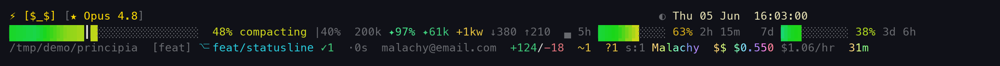
</p>

A little three-line status line for Claude Code. It shows your context, cost, git, and usage limits
at a glance — then lets you theme, animate, and fiddle with basically every pixel. Pure Node.js, no
dependencies beyond `node`, runs anywhere Claude Code does (Windows / macOS / Linux).

It started as "a nicer context bar" and got a bit out of hand: ~80 themes, a dozen bar styles, a pile
of animations, a mood pet that judges your spending, and a styling engine where **every element** can
pick its own colour, weight, capitalisation, font, and animation. All opt-in — the default is calm.

```
⚡ [★ Opus 4.8]                                              ☾ Tue 14 Nov  22:13
▌▌▌▌▌▌▌▌▌▌░░░░░░░░░░░░░░░░░░  42%  |40%   200k  ✦97%   5h ▌▌▌▌▌▌░░░░ 63%   7d ▌▌▌░░ 38%
~/code/principia   ⎇ feat/statusline  +124/-18  ~1            Malachy   $0.23   31m
```

- **Line 1** — model + tier, effort/thinking, fast & vim mode, moon phase, the clock.
- **Line 2** — the context bar (truecolor gradient, half-block sub-sampling), %, token breakdown, and your 5h / 7d usage gauges.
- **Line 3** — working dir, full git status, your account name, session cost & age.

---

## Install

1. Drop `statusline.js` at `~/.claude/statusline.js` (grab it from this repo, or build it — see [Development](#development)).
2. Point Claude Code at it in `~/.claude/settings.json` (Windows: `%USERPROFILE%\.claude\settings.json`):

```json
{
  "statusLine": { "type": "command", "command": "node ~/.claude/statusline.js", "refreshInterval": 1 }
}
```

`refreshInterval` is in **seconds** (minimum `1`); the clock and animations update once per second.

> Claude Code cancels an in-flight status line run when the next refresh fires, so a render that takes
> longer than `refreshInterval` never paints — the clock looks frozen. This status line avoids that by
> construction: the hot path does **no** unbounded work. `git` runs in a detached background process
> (each repaint paints from a cached snapshot and a child refreshes it), and the transcript is read as
> a bounded tail. So `refreshInterval: 1` keeps ticking no matter how big the repo or how long the
> session — worst case you see git data that's a refresh-cycle (~2.5s) stale, never a frozen clock.

**Needs:** `node` (ships with Claude Code), optionally `git`, and a terminal with truecolor (iTerm2,
Terminal.app, Windows Terminal, Ghostty, WezTerm, Kitty, Alacritty, …). It degrades cleanly to 256 /
16 colours and mono if not.

<details>
<summary>Windows notes</summary>
<ul>
<li>Claude Code runs the status line through <b>Git Bash</b> if <a href="https://git-scm.com/downloads/win">Git for Windows</a> is installed, else <b>PowerShell</b> — both work.</li>
<li>Use forward slashes in the path: <code>"command": "node C:/Users/you/.claude/statusline.js"</code></li>
<li>If <code>node</code> isn't on PATH, give its full path: <code>"C:/Program Files/nodejs/node.exe C:/Users/you/.claude/statusline.js"</code></li>
</ul>
</details>

---

## Configure

Everything lives in one JSON file: **`~/.claude/statusline.json`** (or point `SL_CONFIG` at another
path). No config? You get sensible defaults. Bad JSON? Also defaults — it never breaks your prompt.

```json
{
  "theme": "nord",
  "pet": true,
  "burn": true,
  "gitExtra": true
}
```

That's the whole idea: turn things on with one key each. The interesting part is that you can also
restyle **any element** individually.

### Pick a vibe with a preset

`"preset": "pretty"` drops in a bundle of settings; anything you also set yourself wins over it.

<p align="center">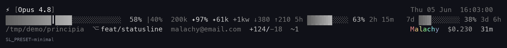</p>

| Preset | Vibe |
|--------|------|
| `minimal` | mono, no motion, plain bar |
| `pretty` | synthwave + wave shimmer, crest, moon, rainbow stats |
| `focus` | calm nord, breathing bar, burn rate + git |
| `chaos` | disco, plasma, pet, the works |
| `demo` | the kitchen-sink showcase |

### Themes

`"theme": "gruvbox"`. There are ~80. A theme recolours the whole line.

<p align="center">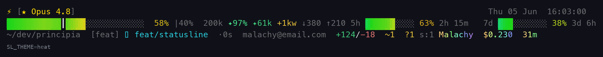</p>

Hue-ramp & designer: `heat` · `synthwave` · `matrix` · `pastel` · `mono` · `dracula` · `nord` ·
`gruvbox` · `tokyonight` · `rosepine` · `catppuccin-{latte,frappe,macchiato,mocha}` ·
`solarized-{dark,light}` · `kanagawa` · `everforest` · `onedark` · `ayu-{dark,mirage,light}` ·
`github-{dark,light}` · `monokai{,-pro}` · `cyberpunk` · `phosphor{,-green,-white}` · `verdigris` ·
`sumi-e` · `stealth` · `zen` · `void` · `gothic` · `oceanic` · identity flags
(`pride` · `trans` · `bi` · `ace` · `nonbinary`).

**Scientific colour maps** (perceptually-uniform, several colour-blind-safe):

<p align="center">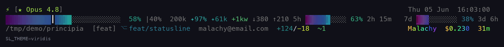</p>

`viridis` · `inferno` · `magma` · `plasma` · `cividis` · `twilight{,_shifted}` · `cubehelix` ·
`batlow` · `turbo` · `coolwarm` · `rdbu` · `ice` · `deep`.

**Reactive themes** — `"autoTheme": "daynight"` (with `dayTheme`/`nightTheme`), `"seasonal"`, or
`"branch"` (theme follows your git branch via `branchThemes`). `silver-halide` adds a darkroom
safelight wash when context gets critical.

<p align="center">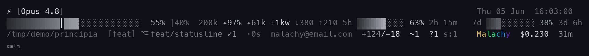</p>

**Roll your own** — `"theme": "custom"` with an inline `customTheme` (a cmap or palette), or point
`themeFile` at a JSON theme, or hand it a `base16` palette string. Themes can also restyle individual
elements (here `cyberpunk` gives the clock an accent and bolds the cost):

<p align="center">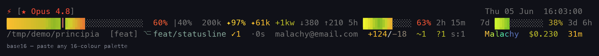</p>

### Bars, scale & motion

`"barStyle": "braille"` — `blocks` · `pacman` · `snake` · `matrix` · `braille` · `battery` · `thermo`
· `shade` · `lines` · `rule` · `equalizer` · `dna` · `train`.

<p align="center">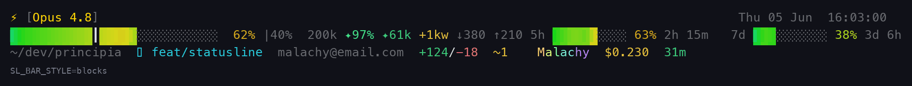</p>

`"barScale": "log"` expands the danger zone so you notice the cliff earlier.

<p align="center">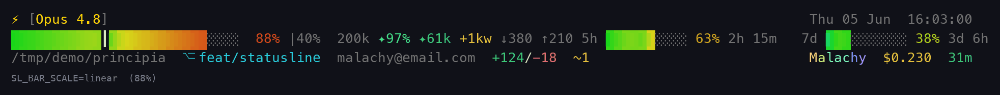</p>

`"shimmer": "wave"` animates the bar crest — `sweep` · `wave` · `comet` · `breathe` · `scan`, plus the
fancy ones: `drift` · `plasma` · `lumin` · `heartbeat` · `twinkle` · `storm` · `glitch` · `morse` ·
`flash` (on % change) · `ripple` (on update). And `disco`, which is a joke mode. Use responsibly.

<p align="center"></p>
<p align="center">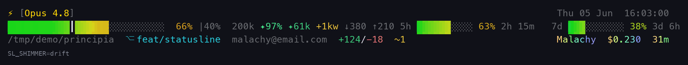</p>
<p align="center">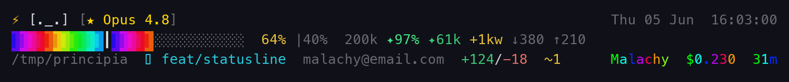</p>

### The extras

Flip any of these on (all default off):

| Key | Does |
|-----|------|
| `pet` | a width-1 ASCII pet whose mood tracks context/cost/git (`petStyle`, `petReactsTo`) |
| `crest` | a tier badge (★/▲/◆) before the model |
| `moon` | current moon phase |
| `daynight` | tints the clock by time of day |
| `gitExtra` | branch state, ahead/behind, commits-today, stash, untracked, last-commit age |
| `gitRisk` | a rough composite "risk" tag |
| `burn` | $/hr burn rate + how it compares to your own median |
| `costFlair` | a `$`/`$$`/`!$` marker by spend |
| `trend` | a sparkline of recent context % + an ETA to autocompact |
| `weather` | a one-word read of context pressure |
| `limits` | flag the usage gauges amber/red near the cap (`limitWarn`, `limitCrit`) |
| `rainbowStats` | rainbow the cost / age numbers |
| `sysinfo` | 1-minute load average |
| `bell` | ring the terminal bell once when context crosses a band |
| `nerdfont` | use Nerd Font glyphs |

Each opt-in extra, shown on its own:

<p align="center">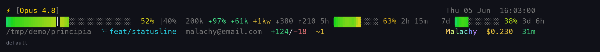</p>

`gitExtra` / `gitRisk` surface your repo at a glance — clean, uncommitted edits, staged, untracked,
stash, ahead/behind upstream, detached HEAD, and a rough risk tag:

<p align="center">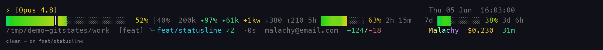</p>

<p align="center">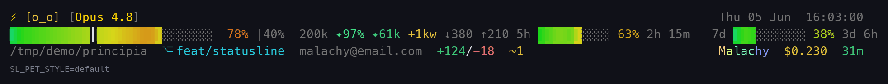</p>
<p align="center">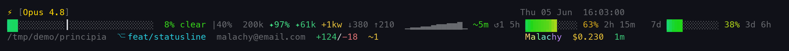</p>

Layout & housekeeping: `"layout"` (`3line` · `2line` · `1line` · `tiny`), `responsive` (pick layout by
width), `hide` (drop named segments), `separator`, `path` (`auto` truncates deep paths), `privacy`
(hide email/account/cost/path for screenshots), `projectAliases`, `customSegment` (run your own
script), `tmuxPassthrough`.

<p align="center">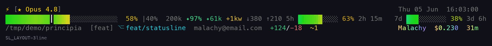</p>

### Style any element yourself

This is the fun part. Every element — `git.branch`, `cost.amount`, `clock`, `name`, `model.tier`,
`bar.empty`, `usage.pct`, … (~55 of them) — flows through one styling engine, so you can override any
of them in `elements`:

<p align="center">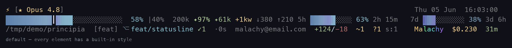</p>

```json
{
  "theme": "tokyonight",
  "elements": {
    "name":        { "fill": "gradient", "anim": { "kind": "wave" } },
    "cost.amount": { "fill": "warn", "weight": "bold" },
    "clock":       { "fill": "muted", "case": "upper" },
    "git.branch":  { "font": "smallcaps" }
  }
}
```

Per element you can set:

- **`fill`** — a semantic role (`fg` · `muted` · `accent` · `ok` · `warn` · `bad` · `info` · `gold`),
  a `#rrggbb`, `gradient` (follows the theme), or `rainbow`. So yes — rainbow name/cost/age are just
  `"fill": "rainbow"`, and you can swap them to a theme-matched `gradient` instead.
- **`weight`** — `normal` · `bold` · `dim`
- **`case`** — `upper` · `lower` · `title`
- **`attrs`** — `italic`, `underline`
- **`anim`** — `wave` · `rainbow` · `gradient-cycle` · `pulse` · `breathe` (with a `speed`)
- **`font`** — opt-in Unicode pseudo-fonts: `bold` · `italic` · `script` · `smallcaps`
  > ⚠️ Pseudo-fonts look great but break exact alignment, copy-paste, and screen readers. Off by
  > default, and never applied to the bar.
- **`glyph`** / **`label`** — change an element's icon or wording.

Themes can ship their own `elements`/`glyphs`/`labels` too, so a theme can genuinely *say different
things*. The cascade is: built-in default → theme → your config → live state.

### Colour depth & accessibility

Auto-detected, override with `SL_COLOR_MODE` (env) or `"colorMode"`: `truecolor` · `256` · `16` ·
`mono`. [`NO_COLOR`](https://no-color.org/) forces mono.

<p align="center">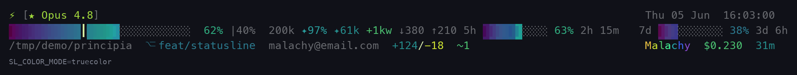</p>

`"accessible": true` is a proper high-contrast mode built to the guidelines (on a dark terminal):
white text, accents lightened to clear **WCAG AAA (7:1)**, motion and pseudo-fonts off, no rainbow —
and it wins over any theme, reaching every element. Pick the gauge with `accessibleGauge`:

| `accessibleGauge` | ramp | notes |
|---|---|---|
| `cvd` *(default)* | blue → cyan → yellow | colour-blind-safe (survives protan/deutan/tritan) |
| `traffic` | green → amber → red | familiar; relies on bar length for CVD users |
| `grayscale` | dim → bright | pure luminance; works on mono displays too |

<p align="center">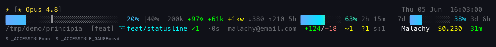</p>

### Coming from the old `SL_*` env vars?

Config used to be ~50 environment variables; it's now the one JSON file. Run this once and save the
output:

```bash
node ~/.claude/statusline.js --migrate > ~/.claude/statusline.json
```

It reads whatever `SL_*` you still have set and prints the equivalent JSON. (`--doctor` will also warn
you if any legacy `SL_*` vars are still hanging around.)

---

## Tooling

```bash
node statusline.js --preview    # render every theme / bar / shimmer
node statusline.js --doctor     # terminal capabilities, active config, conflicts
node statusline.js --report     # summarise your cross-session usage history
node statusline.js --migrate    # legacy SL_* env → JSON config (stdout)
```

---

## Development

TypeScript in `src/`, organised by concern: `build.ts` orchestrates a render; `segments/` builds each
piece (model, git, cost, clock, …), `io/` handles stdin / git-cache / state, `render/` does layout and
the whole-line washes, `anim/` holds the shimmer strategies, over leaf utilities (`style`, `themes`,
`bar`, `ansi`, `color`, `config`, …). esbuild bundles it all into a single zero-dependency CommonJS
`statusline.js` — so the runtime is just `node statusline.js`.

```bash
npm run build        # bundle src → statusline.js
npm run typecheck    # tsc --noEmit
npm run lint         # eslint
npm run test:unit    # fast unit tests, straight from src/ via tsx (no bundle)
npm test             # unit, then build + golden/behaviour tests
npm run goldens      # rebuild and refresh golden snapshots after an intentional change
npm run preview      # build and render the gallery
npm run render       # regenerate the demo GIFs (needs Python + Pillow)
```

Two test layers: pure functions have direct unit tests in `test/unit/` (run via tsx), and the built
artifact is compared to committed golden snapshots in `test/golden/` across colour modes, themes,
layouts, and the styling engine. CI runs typecheck + lint + both suites on Node 18 & 20, and checks the
committed bundle matches a fresh build.

<details>
<summary>How the bar is drawn</summary>
The context bar uses half-blocks (<code>▌</code>) sampled twice per character for a smooth truecolor
gradient, with a moving hue crest. Below truecolor it degrades to solid blocks (256/16) or bold/dim
<code>█</code>/<code>░</code> (mono). Every default glyph is width-1, so the three lines always align.
</details>

---

MIT · made by [@Ma1achy](https://github.com/Ma1achy) with an unreasonable amount of care for a status line.
